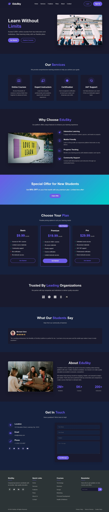

# EduSky - Online Learning Platform



A modern dark-themed online education website with responsive design and professional UI.

## Features

- 🎓 Modern dark theme interface
- 📱 Fully responsive design
- 🚀 Interactive elements with JavaScript
- 💻 Clean, well-structured code
- ✨ Smooth animations and transitions
- 📝 Contact form functionality
- 💰 Pricing plans section
- 🏆 Testimonials section

## Sections Included

1. Sticky navigation bar
2. Hero section with call-to-action
3. Services/Features overview
4. Pricing plans (Basic, Premium, Pro)
5. Trusted companies showcase
6. Student testimonials
7. About us section
8. Contact form
9. Comprehensive footer

## Technologies Used

- HTML5
- CSS3 (Flexbox, Grid, Animations)
- JavaScript (DOM Manipulation, Form Handling)
- Font Awesome Icons

## How to Use

1. Clone this repository:
   ```bash
   git clone https://github.com/muzamal478/edusky-online-learning-platform.git

2. Open index.html in your browser

3. Explore the website and its features

## Project Structure
edusky-online-learning-platform/

- index.html                # Main HTML file
- style.css                 # CSS styles
- script.js                 # JavaScript functionality
- README.md                 # Project documentation
- edusky-screenshot.jpeg    # Screenshot image

## Live Demo
View Live Demo [live demo link here](https://muzamal478.github.io/edusky-online-learning-platform/)

## Contributing
Contributions are welcome! Please fork the repository and create a pull request with your improvements.

## License
This project is open source and available under the MIT License.

👨‍💻 Developed by [Muzamal](https://github.com/muzamal478)
